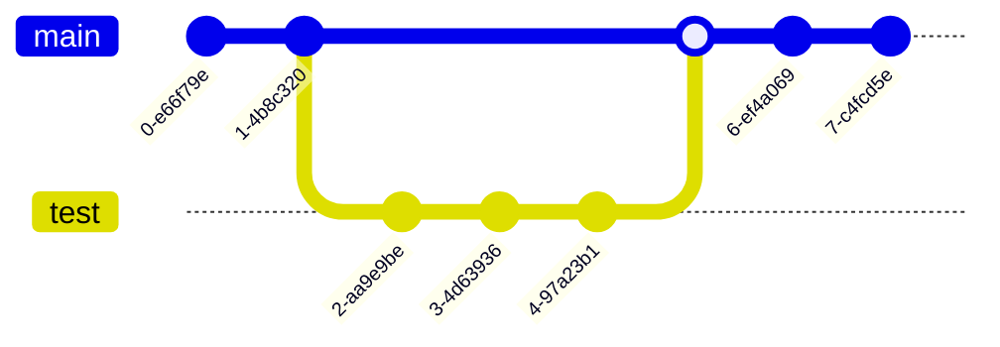

# Projet docker-compose
## Arborescence

	docker-compose/
		 README.md
		docker-compose.yml
		php/
			Dockerfile
		apache/
			my-vhost.conf
		src/
			index.php

---
## Evolution

```mermaid
gitGraph
	commit "First commit"
	commit "update"
	branch test
	checkout test
	commit "New branch"
	commit "test"
	commit "DEBUG SELinux problem"
	checkout main
	merge test
	commit "merge"
	commit "UPDATE README.md"
```
--- 
## Test

